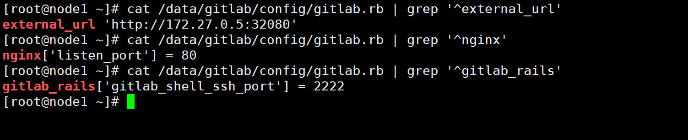

### docker启动gitlab

```javascript
mkdir /data/gitlab
```

### 启动gitlab

```javascript
vi start-gitlab.sh
#!/bin/bash
HOST_NAME=172.27.0.5    #本机IP地址
GITLAB_DIR=/data/gitlab
docker stop gitlab
docker rm gitlab
docker run -d \
    --hostname ${HOST_NAME} \
    -p 8443:443 -p 82:82 -p 2222:22 \
    --name gitlab \
    -v ${GITLAB_DIR}/config:/etc/gitlab \
    -v ${GITLAB_DIR}/logs:/var/log/gitlab \
    -v ${GITLAB_DIR}/data:/var/opt/gitlab \
    gitlab/gitlab-ce:latest

    
#启动
sh start-gitlab.sh
```

### 修改参数

```javascript
vi /data/gitlab/config/gitlab.rb

#本地IP地址，端口不变.
external_url 'http://192.168.2.102:82'

# https需要下面这句
# nginx['redirect_http_to_https_port'] = 82
 
nginx['listen_port'] = 82
 
# 配置2222端口
gitlab_rails['gitlab_shell_ssh_port'] = 2222
```



### 重启

```javascript
sh start-gitlab.sh
```

